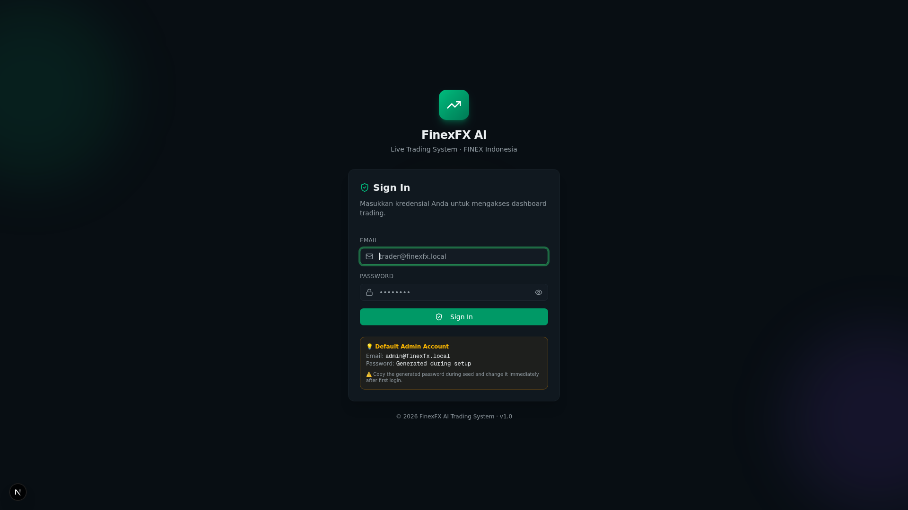

# frxAI — FinexFX AI Trading System

> **Real-trading** Next.js 16 dashboard for a Python + MetaTrader 5 forex scalping bot
> with configurable AI/LLM analysis, paper trading, and automated safety features.
> Pairs: EURUSD, USDJPY, GBPUSD, XAUUSD · Timeframe: M5 · Broker: FINEX Indonesia.

**Version 2.1.0** — LLM provider usage monitoring, confidence threshold fix,
server-side risk validation, LLM call tracking.



---

## Features

### Core Trading
- **Live MT5 Integration** — Real trade execution via Python bridge to MetaTrader 5
- **4 Forex Pairs** — EURUSD, USDJPY, GBPUSD, XAUUSD (M5 scalping)
- **Risk Management** — Configurable max positions, lot size limits, daily risk caps, margin call protection
- **SL/TP Monitor** — Background service auto-checks stop-loss and take-profit levels

### AI Analysis
- **7-Dimension Market Analysis** — Trend, momentum, volatility, support/resistance, patterns, volume, sentiment
- **Configurable LLM Provider** — Ollama (local, free), OpenAI, Groq, or Z.AI sandbox
- **LLM Usage Monitoring** — Real-time provider status, call count, success rate, latency, error tracking (AI panel)
- **News Synthesis** — AI-powered news headline generation and impact analysis
- **Economic Calendar** — AI-synthesized high-impact event awareness

### Safety Features
- **Heartbeat Monitor** — Pings MT5 bridge every 10s, auto-closes all positions after 30s offline
- **Auto-Close** — Emergency close of all open positions on MT5 disconnect
- **BRIDGE_API_KEY Enforcement** — Rejects startup in production without bridge authentication
- **Server-Side Risk Validation** — All numeric risk settings clamped server-side (confidence 30–95%, lots, pips, etc.)

### Operational Tools
- **Paper Trading** — Test strategies with real prices, simulated execution (`PAPER_TRADING=true`)
- **Daily P&L Summary** — Automated daily trade report via Telegram/Discord/Slack webhook
- **Backtesting** — Historical strategy validation using MT5 bar data
- **Audit Logging** — Full activity trail for compliance

---

## Quick Start

### 1. Install dependencies

```bash
bun install
```

### 2. Configure environment

```bash
# macOS / Linux
cp .env.example .env

# Windows PowerShell
Copy-Item .env.example .env
```

Edit `.env` — required settings:

| Variable | Description | Example |
|---|---|---|
| `NEXTAUTH_SECRET` | Generate with `openssl rand -base64 32` | `abc123...` |
| `NEXTAUTH_URL` | Your app URL | `http://localhost:3000` |
| `MT5_PYTHON_BRIDGE_URL` | Python bridge on your Windows MT5 machine | `http://192.168.1.50:5050` |
| `MT5_BRIDGE_URL` | Node.js bridge (default: localhost) | `http://localhost:3050` |
| `BRIDGE_API_KEY` | Shared secret for bridge auth (generate random) | `a1b2c3...` |

See [.env.example](.env.example) for all options including LLM providers and paper trading.

### 3. Initialize database

```bash
mkdir -p db
bun run db:migrate     # Apply Drizzle migrations (creates db/custom.db)
bun run seed           # Seed 30 indicators, risk settings, system config
bun run seed:auth      # Create default admin user (password printed to terminal)
```

### 4. Start the MT5 bridge (Windows machine)

Follow the [Python bridge setup guide](mini-services/mt5-bridge/README.md) to run
`mt5_bridge.py` on your Windows MT5 machine.

### 5. Start the services

```bash
# Terminal 1: Next.js app
bun run dev

# Terminal 2: MT5 bridge (Node.js → Python)
cd mini-services/mt5-bridge && bun run dev

# Terminal 3: Price-feed WebSocket
cd mini-services/price-feed && bun run dev

# Terminal 4: SL/TP monitor
cd mini-services/sl-tp-monitor && bun run dev

# Terminal 5 (optional): Heartbeat monitor
cd mini-services/heartbeat-monitor && bun run dev
```

### 6. Open the dashboard

Open `http://localhost:3000` and log in with:
- **Email**: `admin@finexfx.local`
- **Password**: (printed during `bun run seed:auth` — copy it immediately!)

> **Change the admin password** after first login: Settings → User Management.

### 7. Add your live MT5 account

Go to **Settings** → **Account Management** → **"Tambah Akun"** and enter your live
MT5 credentials. Click **"Connect to MT5"** to verify the bridge connection.

---

## AI / LLM Configuration

The system uses a configurable LLM provider for market analysis, news synthesis,
and economic calendar features. **Default: Ollama (local, free, no API key needed).**

### Ollama (Recommended — Free & Local)

```bash
# Install Ollama: https://ollama.com
# Then pull a model:
ollama pull llama3.1:8b
```

```env
LLM_PROVIDER=ollama
OLLAMA_BASE_URL=http://localhost:11434
OLLAMA_MODEL=llama3.1:8b
```

### OpenAI

```env
LLM_PROVIDER=openai
OPENAI_API_KEY=sk-...
OPENAI_MODEL=gpt-4o-mini
```

### Groq (Free Tier Available)

```env
LLM_PROVIDER=groq
GROQ_API_KEY=gsk_...
GROQ_MODEL=llama-3.3-70b-versatile
```

> If no LLM provider is configured, all AI features fall back to rule-based
> heuristic analysis — the system remains fully functional.

---

## Paper Trading Mode

Test your strategies without risking real money:

```env
PAPER_TRADING=true
```

- Trades are simulated locally using **real price data** from the MT5 bridge
- Paper trades are stored with `source='paper'` in the database
- Can be filtered and analyzed separately from live trades
- Perfect for validating strategies before going live

---

## Tech Stack

| Layer | Tech |
|---|---|
| Frontend | Next.js 16 (App Router), React 19, TypeScript 5, Tailwind CSS 4, shadcn/ui, Recharts, Framer Motion |
| Backend | Next.js API Routes (server-side, `force-dynamic`) |
| Database ORM | Drizzle ORM (`drizzle-orm/better-sqlite3`) with Prisma-compatible facade |
| Database | SQLite (WAL mode) — file at `db/custom.db` |
| Auth | NextAuth.js v4 + bcryptjs + role-based access (admin / trader / viewer) |
| AI / LLM | Configurable: Ollama, OpenAI, Groq (see `src/lib/llm-provider.ts`) |
| Real-time | socket.io (`mini-services/price-feed`, `mt5-bridge`, `sl-tp-monitor`) |
| MT5 Integration | Python bridge (`MetaTrader5` package) on Windows → Node.js bridge (port 3050) |
| State | Zustand (client), TanStack Query (server) |

---

## Architecture

```
src/
├── app/
│   ├── page.tsx              # Single dashboard route `/` (tabbed layout)
│   ├── login/                # Auth page
│   ├── layout.tsx
│   └── api/                  # 25+ API route groups (server-side)
│       ├── accounts, trades, orders, indicators, symbols
│       ├── ai (analyze, auto-trade, evaluate, quality, signals)
│       ├── alerts, analytics, auth, backtest
│       ├── dashboard, economic-calendar, health, logs
│       ├── mt5, news, notifications, risk, sessions
│       ├── strategies, system (backup, config, daily-summary, webhook-test)
│       └── users
├── components/
│   ├── panels/               # 12 dashboard panels (trading, ai, news, etc.)
│   ├── layout/               # Sidebar, topbar, footer
│   ├── trading/              # Partial close dialog, sparkline
│   └── ui/                   # shadcn/ui components
├── hooks/                    # usePriceFeed, useAutoPilot, useActiveAccount, etc.
├── lib/
│   ├── db.ts                 # Drizzle-backed facade (Prisma-compatible API)
│   ├── db/schema.ts          # 16 Drizzle tables
│   ├── llm-provider.ts       # Multi-provider LLM abstraction (v2.0)
│   ├── llm-usage.ts          # LLM call tracking (count, latency, errors)
│   ├── ai.ts                 # 7-dimension market analysis
│   ├── auto-close.ts         # Emergency position close (v2.0)
│   ├── paper-trading.ts      # Simulated trading engine (v2.0)
│   ├── daily-summary.ts      # Daily P&L report generator (v2.0)
│   ├── mt5-client.ts         # Typed HTTP client (with BRIDGE_API_KEY auth)
│   ├── market.ts             # Live price fetch from MT5 bridge
│   ├── market-math.ts        # Pure math (calcPnl, calcLotSize) — client-safe
│   ├── risk-enforcement.ts   # Server-side risk gate
│   ├── backtest.ts           # Strategy backtesting
│   ├── webhook.ts            # Telegram/Discord/Slack notification sender
│   └── types.ts              # Shared TypeScript interfaces
└── middleware.ts             # Auth guard + rate limiting

mini-services/
├── mt5-bridge/               # Port 3050 — HTTP bridge to Python MT5
│   ├── adapters/real-python.ts
│   ├── python/mt5_bridge.py
│   └── README.md
├── price-feed/               # Port 3003 — WebSocket live ticks
├── sl-tp-monitor/            # Background SL/TP + reconcile + AI eval + backup
└── heartbeat-monitor/        # Port 3060 — MT5 bridge health (v2.0)

drizzle/                      # Generated SQL migrations
prisma/                       # Seed scripts (Drizzle-backed)
scripts/                      # CLI utilities (seed-auth, reset-db)
```

---

## Database

### Schema
- **Active schema**: `src/lib/db/schema.ts` — 16 tables
- **DB client**: `src/lib/db.ts` — exports `db` (Prisma-compatible facade)
- **Migration files**: `drizzle/` — generated by `drizzle-kit`

### Why a Prisma-compatible facade?
45+ API route files use Prisma-style calls (`db.trade.findMany()`, etc.).
The facade maps these to native Drizzle queries. Use `db.$drizzle` for native Drizzle.

### Commands

```bash
bun run db:push       # Sync schema → SQLite (no migration files)
bun run db:generate   # Generate SQL migration files in /drizzle
bun run db:migrate    # Apply pending migrations
bun run db:studio     # Open Drizzle Studio (GUI inspector)
bun run db:reset      # Drop DB + re-push + re-seed
bun run seed          # Seed indicators + risk settings + system config
bun run seed:auth     # Seed default admin user
```

---

## Daily P&L Summary

The system can send an automated daily trading report via webhook:

```env
# Enable daily summary (cron: every day at 22:00 UTC)
DAILY_SUMMARY_CRON=0 22 * * *

# Configure at least one webhook destination
DISCORD_WEBHOOK_URL=https://discord.com/api/webhooks/...
TELEGRAM_BOT_TOKEN=123456:ABC...
TELEGRAM_CHAT_ID=-1001234567890
```

You can also trigger it manually: `POST /api/system/daily-summary`

---

## Testing

```bash
bun test              # Run all tests
bun run lint          # ESLint check
```

| Test | Coverage |
|---|---|
| `market.test.ts` | `calcPnl`, `calcLotSize` (pure math) |
| `db-transactions.test.ts` | Atomic trade close/partial-close |
| `risk-enforcement.test.ts` | Risk gate validation |
| `ai-evaluation.test.ts` | AI signal accuracy tracking |
| `backtest.test.ts` | Backtest simulation logic |
| `auth.test.ts` | Password hashing + role checks |
| `format.test.ts` | UI formatting helpers |

---

## License

All rights reserved.

---

## Security Notes

1. **MT5 credentials** are passed through the bridge to `mt5.login()` and discarded — never stored in the database.
2. **The Python bridge requires `BRIDGE_API_KEY`** — set the same key in both the Python bridge and `.env`.
3. **Change the default admin password** immediately after first login.
4. **Generate unique `NEXTAUTH_SECRET`** and `BRIDGE_API_KEY` — don't use the placeholder values.
5. **Run the Python bridge** only on a trusted internal network or behind a VPN.

---

## Disclaimer

**REAL TRADING MODE** — This system executes trades with real money on live MT5 accounts.

1. **Test with small lots (0.01)** for several days first
2. **Set conservative risk management** initially (0.5% per trade, 2% daily limit)
3. **Monitor trade logs** regularly
4. **Use paper trading mode** (`PAPER_TRADING=true`) to validate strategies first
5. **Don't leave the system unattended** for extended periods without monitoring

The author is not responsible for financial losses from using this system.